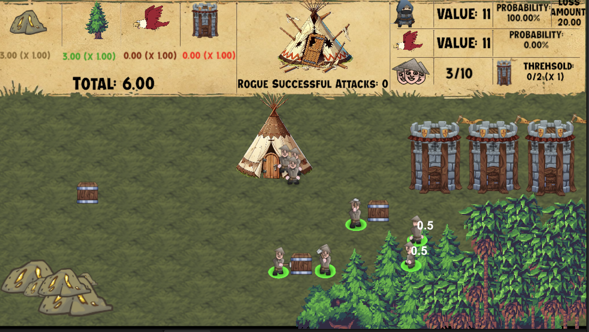
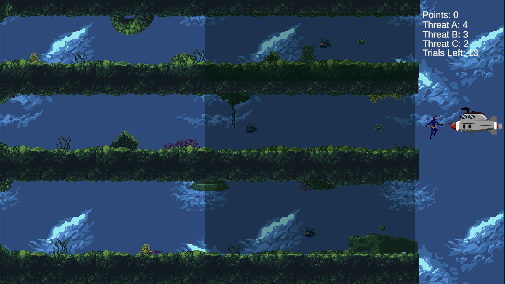
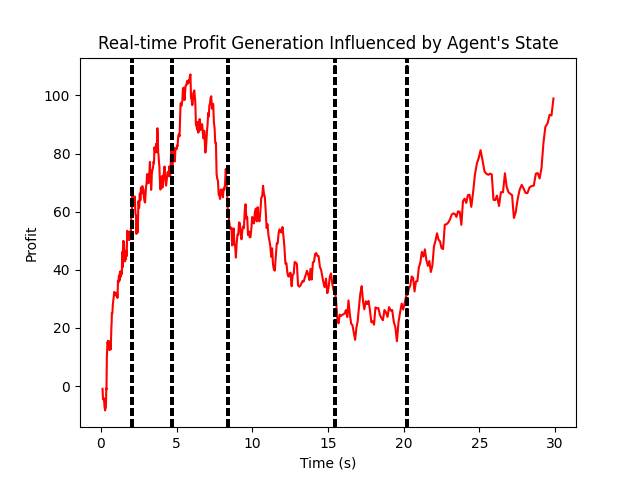

<!-- # yanntex.github.io -->

# Presentation

Hi, I’m Yannis Texier.  
I am a graduate of the Paris School of Economics (ENS Ulm & Paris 1 Panthéon-Sorbonne), with a deep passion for decision-making and interdisciplinary research. My interests span across Economics, Psychology, Cognitive Neuroscience, Mathematics, and Machine Learning.  

My enthusiasm for research stems from a desire to create real-life applications, whether in business or in everyday decision-making. I have successfully translated theoretical knowledge into practical solutions in various environments, including sports such as Thai boxing, free diving, and ultramarathons, as well as in business contexts like content creation.  

Below, you’ll find a portfolio that summarizes my work.

# Education

| Degree                       | Institution                      | Year  |
|------------------------------|----------------------------------|-------|
| MRes, Analysis and Economic Policy | Paris School of Economics         | 2025  |
| B.S, Quantitative Economics  | Paris 1                           | 2021  |

# Work Experience
## Research Assitant @ INSERM (2024)
- Developed two videogames that gamifies cognitive task and will be studied in an FMRi and TFUs studies
- Established new paradigms to study decision-making and designed games around it.

# Stakeholder Portfolio 

## Behavioral Strategy for Players In-Game Expenditures

In this [sample of work](https://drive.google.com/file/d/1EB9RTNsNvzpCg_jEJwtXzK-2WKRrBWy6/view?usp=sharing) I used data from a survey on Animal Crossing Players. I use it as a generic data for mobile game and set up strategies to increase firms's profit.

The Data Analysis was done with **Python**

# Research Portfolio

## Gamifying Decision-Making Under Uncertainty

### Overview
I developed a game under the supervision and collaboration with [Nils Kolling](https://sites.google.com/view/ecc-team/home). The goal is to gamify the scientific study of decision-making. Current paradigms often use lotteries to study decision-making, but these fail to reflect the ecological settings in which humans evolve. Moreover, they do not allow the study of some cognitive properties that may emerge with more complex decisions.

The game has been developed using **Unity** and **C#**.

### Gameplay Description
- **Objective**: Gamify the problem of asset allocation under uncertainty.
- **Mechanics**:
  - The decision-making process is sequential.
  - Players are endowed with an initial amount of capital to invest in three assets, each with distinct return properties.
  - Players encounter:
    1. **Opportunities**: Provide potential rewards.
    2. **Dangers**: May result in losing part of the endowment.

- **Key Challenge**: Anticipate uncertainty in asset returns, as well as the probabilities of opportunities and dangers appearing.

### Applications
- The game allows the study of multiple effects that cannot be analyzed with classical decision-making frameworks.
- It has potential applications in **psychiatric research**, such as:
  - Understanding addiction.
  - Identifying decision-making dysfunctions.

---

## Gamifying Decision-Making: Motivational Persistence Under Threat
### Overview
I am developing this game in collaboration with **Tristan White** and under the supervision of [Nils Kolling](https://sites.google.com/view/ecc-team/home). The objective is to gamify the scientific study of decision-making, focusing on **motivational persistence under threat**.

Similar to the previous project, current paradigms use lotteries to study decision-making, which do not accurately reflect ecological settings or enable the study of complex cognitive processes. This game is also being developed with **Unity** and **C#**.

### Gameplay Description
- **Objective**: Study persistence toward a goal in the presence of threats.
- **Mechanics**:
  - The player controls a diver who must choose one of three paths.
  - Each path presents:
    - Different reward levels.
    - Different threat levels.
  - The player must decide whether to persist on a path despite threats or switch to another.

### Applications
- Study **motivation under threat**, examining:
  - How levels of threat and reward influence persistence.
  - The impact of emotions on decision-making and motivation.

- This game enables the study of effects not accessible with classical frameworks. It will be further explored using:
  - **fMRI studies** (functional Magnetic Resonance Imaging).
  - **tFUS studies** (transcranial Focused Ultrasound Stimulation).

---

## Developing New Models for the Foundations of Decision-Making

### Overview
I am working on a new framework for decision-making under the supervision of [Raphael Douady](https://raphaeldouady.com). This project is a **work in progress**.

### Progress So Far
- **Cognitive Task**:
  - Developed a task where players maximize the profit of their firm.
  - Players draw different types of agents randomly, each generating profits every 0.1 seconds.
  - Time constraints are introduced to study how they influence decision-making.
  - Hypotheses were tested through experiments and confirmed.

- **Game Theory Application**:
  - Currently developing a two-player game inspired by Game Theory.
  - Players compete against each other, applying insights from the previous experiment to analyze decision-making.
  - The theory aims to provide a new framework for understanding decision-making processes.

---

### Notes:
- This repository documents the progress and details of my work on gamifying decision-making and developing new models for understanding cognitive processes.
- Stay tuned for updates, additional details, and publications related to these projects.
